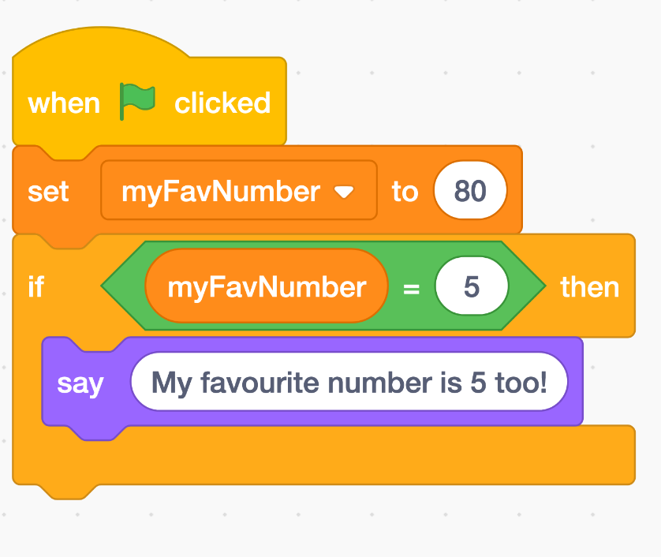
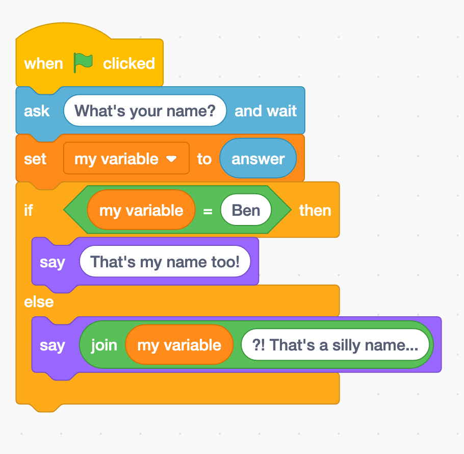
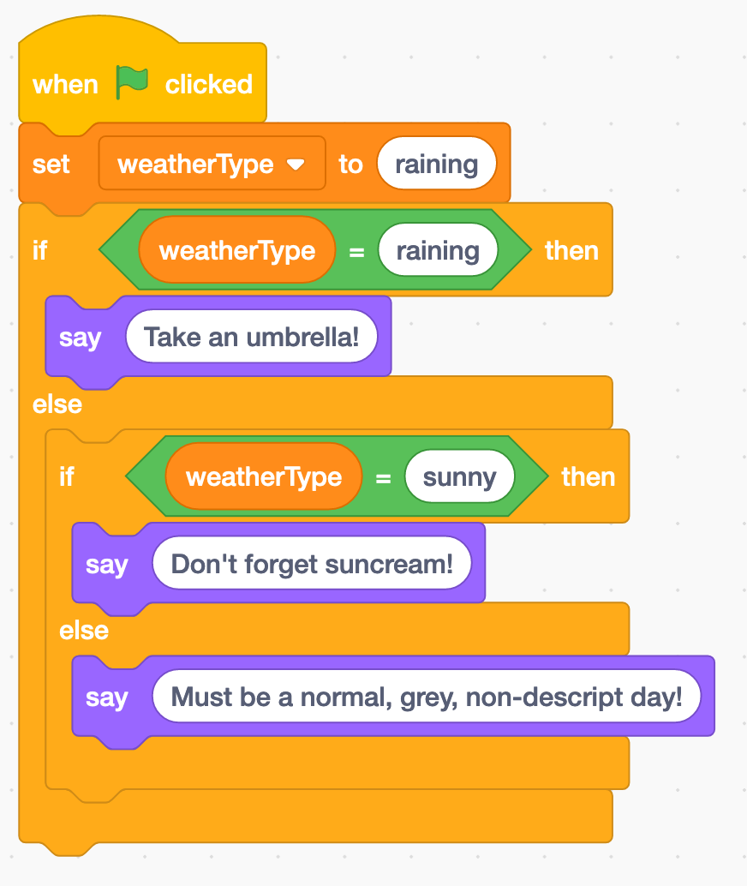

# JS 101 - Conditional Statements

Conditional statements allow us to write programs that perform the different actions depending on the situation. The main way we write these is with `if`, `else` and `else if` statements.

### The basic if...

```js
if (condition) {
  // code to run if condition is true
}
```

Inside the smooth brackets, the if statement expects a expression that resolves to `true` or `false`. This is called a boolean expression.

Example boolean expressions...

- `1 > 3` (false)
- `1 === 1` (true)
- `8 < 10` (true)

```js
if (1 > 3) {
  console.log("Well, duh! Of course 1 isn't greater than three...");
}
```

Well yes, one is always going to be greater than three. We will usually be checking something that can change like a variable.

```js
let numberOfPies = getPieCount();

if (numberOfPies < 1) {
  console.log("Who ate all the pies???");
}
```

### If/else

The else statement will run if the the previous ifs or if elses have not run. There can **only** be one and it **must** be the last in the chain.

```js
let numberOfPies = getPieCount();

if (numberOfPies < 1) {
  console.log("Who ate all the pies???");
} else {
  console.log("We got pies! Who's hungry?");
}
```

### Else If

You can put as many else ifs in as you like, they **cannot** be first as the chain must always start with an if. You **must** supply a condition.

```js
let numberOfPies = getPieCount();

if (numberOfPies < 1) {
  console.log("Who ate all the pies???");
} else if (numberOfPies < 5) {
  console.log("Not many pies left, get them whilst you can!");
} else {
  console.log("We got pies! Who's hungry?");
}
```

## Exercises

We are going to use our new found javascript skills and of our existing knowledge of scratch to translate some blocks to real code.

For example this block...


Could be translated to JavaScript like so...

```js
console.log("Hello!");
```

This block...


in JS could be...

```js
let myVariable = 88;
```

This block...


could be...

```js
let answer = alert("What's your name?");
```

Our task is to translate the following code blocks into JavaScript.

### Task 1



<details>
<summary>Answer</summary>

```js
let myFavNumber = 80;

if (myFaveNumber === 5) {
  console.log("My favorite number is 5 too!");
}
```

</details>

### Task 2



<details>
<summary>Answer</summary>

```js
let answer = prompt("What's your name?");

if (answer === "Ben") {
  console.log("That's my name too!");
} else {
  console.log(`${answer}?! That's a silly name...`);
}
```

</details>

### Task 3



<details>
<summary>Answer</summary>

```js
let weatherType = "raining";

if (weatherType === "raining") {
  console.log("Take an umbrella!");
} else if (weatherType === "raining") {
  console.log("Don't forget suncream!");
} else {
  console.log("Must be a normal, grey, nondescript day!");
}
```

</details>
